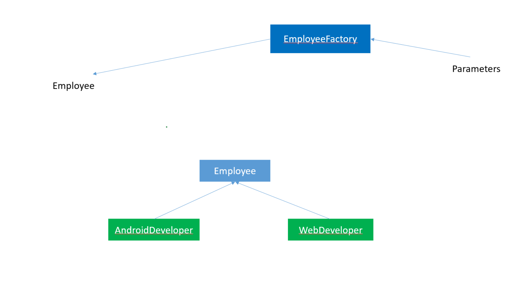
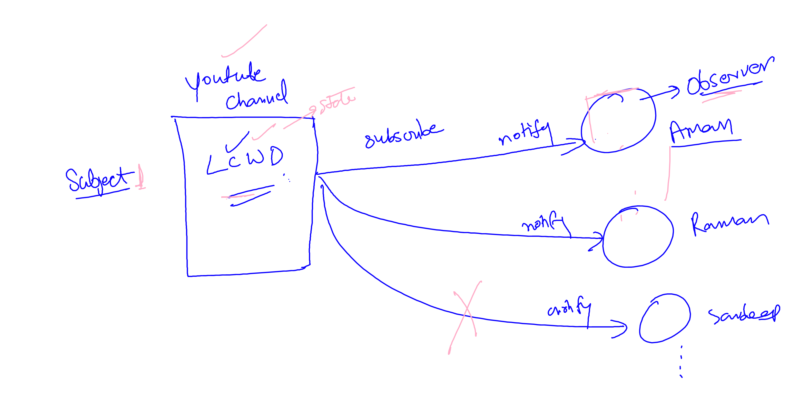

# DesignPatternExample
# 1. Creational Design Pattern: 
# Singleton Design Pattern

The Singleton design pattern is a creational design pattern that restricts the instantiation of a class to a single object and provides global access to that instance throughout the application. This pattern ensures that only one instance of a class is created and provides a global point of access to it.

## Singleton Object

Singleton object are the object which are instantiated only once for project (jvm).
If we try to get the object then we get same object again and again.

### lets create singleton patter using java

Lazy way of creating singleton object

```java
class Example{


private static Example ob;

public static Example getExample(){
    if(ob==null){
        ob=new Example();
    }
    return ob;
}


}

```

### calling the singleton object

```java
class Main
{
    public static void main(String args[]){
        Example ob=Example.getExample()
        //using the object

    }

}
```

Eager way of creating Singleton object

```java
class Example{


private static Example ob=new Example();

public static Example getExample(){
      return ob;
}


}

```

Accessing object

```java

class Main
{
    public static void main(String args[]){
        Example ob=Example.getExample()
        //using the object

    }
    }
}

```

> note: for multithreaded environment we use syncronized block for creating singleton object.

```java
class Example{


private static Example ob;

public static Example getExample(){
    if(ob==null){
      syncronized(Example.class){
        if(ob==null)
        {
              ob=new Example();
        }
      }
    }
    return ob;
}


}


```

## Breaking Singleton Design Pattern

### There are three ways to break singleton design pattern . Lets talk about the these way and i am also going to tell you about the solution of these problems.

## 1. Using Reflection API

With the help of relfection api we can call private constructor as well and create multiple object by calling private constructor.

### lets see how we can call private constructor

```java

Constructor<Example> constructor=Example.class.getDeclaredConstructor()

//changing the accessibility to true
constructor.setAccessible(true)

Example example=constructor.newInstance();
```

## solution

### we can do the soultion in two ways.

1. using ENUM

```java

public enum Example{
    INSTANCE
}

```

2. check the object in private constructor if the object exists then throw exception to terminate the execution.

```java


private Exmaple(){

    if(ob!=null)
    {
        throw new RuntimeExcepiton("you are trying to break singleton pattern")
    }
}


```

## 2. Using Deserialization

when we serialze and deserialze the singleton object then singleton automatically got destroyed and provide us different object.

```java
   ObjectOutputStream oos = new ObjectOutputStream(new
        FileOutputStream("abc.ob"));
        oos.writeObject(ob);

        System.out.println("serialization done..");

        ObjectInputStream ois = new ObjectInputStream(new FileInputStream("abc.ob"));
        Example s2 = (Example) ois.readObject();
        System.out.println(s2.hashCode());


```

### solution:

just implement readResolve() method

```java
    public Object readResolve() {
        return ob;
    }

```

## 3. Using cloning

when we clone then also we get different object.

## solution

just override clone method and return the same instance.

```java

    @Override
    public Object clone() throws CloneNotSupportedException {
        return samosa;
    }

```

# Factory Design Pattern

### Factory Method Design Pattern

When there is superclass and multiple subclasses and we want to get object of subclasses based on input and requirement.

Then we create factory class which takes the responsibility of creating object of class based on input.

## Advantages of Factory Design Pattern

1. Focus on creating object for Interface rather than implementation.

2. Loose coupling, more robust code



# Abstract Factory Design Pattern

Similar to Factory Pattern

It provide the concept of Factory of Factories.


# Builder Design Pattern

while creating object when object contain may attributes
there are many problem exists :

1. we have to pass many arguments to create object.
2. some parameters might be optional
3. factory class takes all responsibility for creating object . if the object is heavy then all complexity is the part of factory class.

### So in builder pattern be create object step by step and finally return final object with desired values of attributes.

---

## Prototype Design Pattern

The concept is to copy an existing object rather than creating a new instance from scratch. because creating new object may be costly.

This approach saves costly resources and time, especially when object creation is a heavy process.

# 1. Shallow Copy
A shallow copy creates a new object, but it copies only the references of nested objects rather than duplicating them. This means that changes in the nested objects of the copied instance will reflect in the original instance.

## Example of Shallow Copy

``` java
class Address {
    String city;

    public Address(String city) {
        this.city = city;
    }
}

class PersonShallow implements Cloneable {
    String name;
    Address address;

    public PersonShallow(String name, Address address) {
        this.name = name;
        this.address = address;
    }

    // Implementing Shallow Copy using clone()
    @Override
    protected Object clone() throws CloneNotSupportedException {
        return super.clone();  // Default implementation performs a shallow copy
    }

    public void display() {
        System.out.println("Name: " + name + ", City: " + address.city);
    }
}

public class ShallowCopyExample {
    public static void main(String[] args) throws CloneNotSupportedException {
        Address address = new Address("New York");
        PersonShallow person1 = new PersonShallow("John", address);

        // Creating a shallow copy
        PersonShallow person2 = (PersonShallow) person1.clone();

        // Changing the city in person2
        person2.address.city = "Los Angeles";

        // Display both objects
        person1.display();  // Output: Name: John, City: Los Angeles
        person2.display();  // Output: Name: John, City: Los Angeles
    }
}

```

## Explanation
- The clone() method performs a shallow copy.
- person2 gets a new instance of PersonShallow, but the Address reference is shared.
- Changing person2.address.city affects person1.address.city since both refer to the same memory location.

# 2. Deep Copy
A deep copy creates a completely independent duplicate of the object, including all nested objects. Any changes in the copied object do not affect the original.

## Example of Deep Copy
``` java
class AddressDeep {
    String city;

    public AddressDeep(String city) {
        this.city = city;
    }

    // Implementing deep copy for Address
    public AddressDeep deepCopy() {
        return new AddressDeep(this.city);
    }
}

class PersonDeep implements Cloneable {
    String name;
    AddressDeep address;

    public PersonDeep(String name, AddressDeep address) {
        this.name = name;
        this.address = address;
    }

    // Implementing Deep Copy using clone()
    @Override
    protected Object clone() throws CloneNotSupportedException {
        PersonDeep cloned = (PersonDeep) super.clone();
        cloned.address = this.address.deepCopy();  // Manually cloning Address
        return cloned;
    }

    public void display() {
        System.out.println("Name: " + name + ", City: " + address.city);
    }
}

public class DeepCopyExample {
    public static void main(String[] args) throws CloneNotSupportedException {
        AddressDeep address = new AddressDeep("New York");
        PersonDeep person1 = new PersonDeep("John", address);

        // Creating a deep copy
        PersonDeep person2 = (PersonDeep) person1.clone();

        // Changing the city in person2
        person2.address.city = "Los Angeles";

        // Display both objects
        person1.display();  // Output: Name: John, City: New York
        person2.display();  // Output: Name: John, City: Los Angeles
    }
}


```
## Explanation
- person2 gets a new instance of PersonDeep and a new instance of AddressDeep.
- Changes to person2.address.city do not affect person1.address.city because both refer to different memory locations.

##  Key Differences: Shallow Copy vs Deep Copy


## When to Use Which?
- Use Shallow Copy when:
    - You don't need separate copies of nested objects.
    - The nested objects are immutable (e.g., String).
- Use Deep Copy when:
    - Each copy should be completely independent.
    - You're working with modifiable nested objects.

## Conclusion
- Shallow Copy is faster but risky if modifications are needed.
- Deep Copy ensures full independence but requires extra effort.
- Use clone() for shallow copy and manually copy nested objects for deep copy.

# 2. Behavirol Design Pattern:

# Observer Design Pattern

- It is behavioural Design pattern.
- In this when subject changes the state all its dependent objects notified the changes.
- one to many relation.

  

# Iterator Design Pattern

The Iterator Design Pattern is a behavioral design pattern that provides a way to sequentially access elements of a collection (e.g., a list, array, or custom data structure) without exposing the underlying structure.

The key idea is to decouple the iteration logic from the collection itself. This allows different types of collections to implement their own iteration mechanisms.

## Key Components of Iterator Pattern
1. Iterator Interface: Defines the methods for accessing and traversing elements, such as next() and hasNext().

2. Concrete Iterator: Implements the Iterator interface for a specific collection.

3. Collection Interface: Defines the method to return an iterator, such as createIterator().

4. oncrete Collection: Implements the Collection interface and provides the iterator for its data structure.

## Advantages
- Hides the underlying collection structure.
- Provides a consistent way to traverse different types of collections.
- Simplifies code by handling iteration logic in one place.

## Key Points
- The ShoppingCart class does not expose its internal structure (the list of items).
- The iteration logic is encapsulated within the CartIterator class, keeping the collection code clean and focused.
---

# Command Design Pattern
The Command Design Pattern is a behavioral design pattern that turns a request into an object, allowing you to parameterize objects with different requests, delay execution of a request, or support undoable operations.

This pattern encapsulates a request as an object, decoupling the sender (who invokes the request) from the receiver (who executes the request).

## Key Components
1. Command: An interface or abstract class that declares the execute() method.
2. Concrete Command: Implements the Command interface, linking a receiver with a specific action.
3. Receiver: The object that performs the actual work when the command is executed.
4. Invoker: Stores the command and invokes the execute() method.
5. Client: Configures the objects and triggers the actions via the invoker.

## Advantages
- Decouples the sender and receiver.
- Supports undo/redo operations.
- Simplifies complex interactions by encapsulating requests.

**Example in Java** <br/>
Imagine a Home Automation System where a remote control sends commands to control various appliances like lights and fans. Each button on the remote corresponds to a specific command.

**Step 1: Define the Command Interface** <br/>
``` java
interface Command {
    void execute();
}
```
**Step 2: Create Receiver Classes** <br/>
These classes perform the actual work.

**Light Receiver:**
``` java

class Light {
    public void turnOn() {
        System.out.println("The light is ON.");
    }

    public void turnOff() {
        System.out.println("The light is OFF.");
    }
}

```
**Fan Receiver:** <br/>
``` java
class Fan {
    public void start() {
        System.out.println("The fan is ON.");
    }

    public void stop() {
        System.out.println("The fan is OFF.");
    }
}


```
**Step 3: Create Concrete Command Classes**<br/>
These classes implement the Command interface and define the actions.

**Light On Command:**
``` java

class LightOnCommand implements Command {
    private Light light;

    public LightOnCommand(Light light) {
        this.light = light;
    }

    @Override
    public void execute() {
        light.turnOn();
    }
}

```
**Light Off Command:**<br/>
``` java
class LightOffCommand implements Command {
    private Light light;

    public LightOffCommand(Light light) {
        this.light = light;
    }

    @Override
    public void execute() {
        light.turnOff();
    }
}

```
**Fan On Command:**<br/>
``` java
class FanOnCommand implements Command {
    private Fan fan;

    public FanOnCommand(Fan fan) {
        this.fan = fan;
    }

    @Override
    public void execute() {
        fan.start();
    }
}

```
**Fan Off Command:**<br/>
``` java
class FanOffCommand implements Command {
    private Fan fan;

    public FanOffCommand(Fan fan) {
        this.fan = fan;
    }

    @Override
    public void execute() {
        fan.stop();
    }
}

 
```
**Step 4: Create the Invoker**<br/>
The remote control class stores and invokes commands.

``` java
class RemoteControl {
    private Command command;

    public void setCommand(Command command) {
        this.command = command;
    }

    public void pressButton() {
        command.execute();
    }
}

```
**Step 5: Use the Pattern in the Client**<br/>
``` java
public class HomeAutomationTest {
    public static void main(String[] args) {
        // Receivers
        Light livingRoomLight = new Light();
        Fan ceilingFan = new Fan();

        // Commands
        Command lightOn = new LightOnCommand(livingRoomLight);
        Command lightOff = new LightOffCommand(livingRoomLight);
        Command fanOn = new FanOnCommand(ceilingFan);
        Command fanOff = new FanOffCommand(ceilingFan);

        // Invoker
        RemoteControl remote = new RemoteControl();

        // Test Light Commands
        remote.setCommand(lightOn);
        remote.pressButton(); // The light is ON.

        remote.setCommand(lightOff);
        remote.pressButton(); // The light is OFF.

        // Test Fan Commands
        remote.setCommand(fanOn);
        remote.pressButton(); // The fan is ON.

        remote.setCommand(fanOff);
        remote.pressButton(); // The fan is OFF.
    }
}

```
## Output
``` java
The light is ON.
The light is OFF.
The fan is ON.
The fan is OFF.

```
## Key Takeaways
1. Decoupling: The RemoteControl (Invoker) is decoupled from the Light and Fan (Receivers). It only knows about the Command interface.
2. Flexibility: Adding new devices (e.g., TV, AC) or commands (e.g., dim lights) requires creating new Command and Receiver classes without modifying existing code.
3. Extensibility: Supports undo/redo functionality by storing executed commands in a stack.

# Strategy Design Pattern
The Strategy Design Pattern is a behavioral design pattern that defines a family of algorithms, encapsulates each one, and makes them interchangeable. This pattern enables the algorithm to vary independently from the clients that use it.

## Key Concepts
1. Context: The class that uses a strategy.
2. Strategy Interface: Defines a common interface for all supported algorithms.
3. Concrete Strategies: Implement the strategy interface, each defining a specific algorithm.
4. Client: Configures the context with a strategy and invokes the context's methods.

## Advantages
- Promotes the Open/Closed Principle by allowing new algorithms to be added without modifying existing code.
- Simplifies code by delegating behavior to different classes.
- Encourages the use of composition over inheritance.

## Example in Java
Imagine a Payment System where you want to support multiple payment methods like Credit Card, PayPal, and Google Pay. The strategy pattern allows you to encapsulate the logic for each payment method into its own class.

**Step 1: Define the Strategy Interface**<br/>
The interface defines a method for making a payment.

``` java
interface PaymentStrategy {
    void pay(int amount);
}

```
**Step 2: Create Concrete Strategy Classes**<br/>
Each class implements the payment logic for a specific method.

**Credit Card Payment:**

``` java
class CreditCardPayment implements PaymentStrategy {
    private String cardNumber;

    public CreditCardPayment(String cardNumber) {
        this.cardNumber = cardNumber;
    }

    @Override
    public void pay(int amount) {
        System.out.println("Paid " + amount + " USD using Credit Card: " + cardNumber);
    }
}

````

**PayPal Payment:**

``` java

class PayPalPayment implements PaymentStrategy {
    private String email;

    public PayPalPayment(String email) {
        this.email = email;
    }

    @Override
    public void pay(int amount) {
        System.out.println("Paid " + amount + " USD using PayPal account: " + email);
    }
}

```

**Google Pay Payment:**

``` java

class GooglePayPayment implements PaymentStrategy {
    private String phoneNumber;

    public GooglePayPayment(String phoneNumber) {
        this.phoneNumber = phoneNumber;
    }

    @Override
    public void pay(int amount) {
        System.out.println("Paid " + amount + " USD using Google Pay linked to phone: " + phoneNumber);
    }
}


````

**Step 3: Create the Context Class**<br/>
The ShoppingCart class uses a PaymentStrategy to complete the payment process.

``` java
class ShoppingCart {
    private PaymentStrategy paymentStrategy;

    // Set the payment strategy dynamically
    public void setPaymentStrategy(PaymentStrategy paymentStrategy) {
        this.paymentStrategy = paymentStrategy;
    }

    public void checkout(int amount) {
        if (paymentStrategy == null) {
            throw new IllegalStateException("Payment strategy is not set!");
        }
        paymentStrategy.pay(amount);
    }
}


````
**Step 4: Use the Strategy Pattern in the Client** <br/>
``` java
public class StrategyPatternTest {
    public static void main(String[] args) {
        ShoppingCart cart = new ShoppingCart();

        // Pay using Credit Card
        cart.setPaymentStrategy(new CreditCardPayment("1234-5678-9876-5432"));
        cart.checkout(100); // Paid 100 USD using Credit Card.

        // Pay using PayPal
        cart.setPaymentStrategy(new PayPalPayment("user@example.com"));
        cart.checkout(200); // Paid 200 USD using PayPal.

        // Pay using Google Pay
        cart.setPaymentStrategy(new GooglePayPayment("9876543210"));
        cart.checkout(300); // Paid 300 USD using Google Pay.
    }
}


````
## Output
``` java

Paid 100 USD using Credit Card: 1234-5678-9876-5432
Paid 200 USD using PayPal account: user@example.com
Paid 300 USD using Google Pay linked to phone: 9876543210


````

## Key Takeaways
1. Dynamic Behavior: The ShoppingCart class doesn't contain payment logic. It delegates payment tasks to the appropriate PaymentStrategy.
2. Flexibility: Adding new payment methods is straightforward—create a new class implementing PaymentStrategy.
3. Encapsulation: Each payment algorithm is encapsulated in its own class, making the code easy to understand and maintain.

# 3. Structural Design Pattern:

# Adapter Design Pattern

- The Adapter Design Pattern is a structural design pattern that allows two incompatible interfaces to work together. It acts as a bridge between the client and a service, enabling objects with different interfaces to collaborate.

**Key Concepts**<br/>
- Target Interface: The interface expected by the client.
- Adapter: A class that implements the target interface and translates the client’s requests into a format that the adaptee can understand.
- Adaptee: The existing interface that needs adapting.
- Client: The code that interacts with the target interface.

**Advantages**<br/>
- Promotes code reusability by adapting incompatible interfaces.
- Decouples the client from the implementation details of the adaptee.

**Example in Java** <br/>
Imagine you are building a payment system where your app needs to support both Stripe and PayPal payment gateways. These two gateways have different APIs. By using the Adapter Pattern, you can create a unified interface for payment processing.

**Step 1: Define the Target Interface**
- The PaymentProcessor interface is what the client expects.

```java
interface PaymentProcessor {
    void pay(int amount);
}
```
**Step 2: Create the Adaptee Classes**<br/>
These are the existing payment gateways with their unique APIs.

**Stripe Payment Gateway:**
``` java
class StripePayment {
    public void makePayment(int amountInCents) {
        System.out.println("Paid " + amountInCents / 100 + " USD using Stripe.");
    }
}

```
**PayPal Payment Gateway:**

``` java
class PayPalPayment {
    public void sendPayment(double amount) {
        System.out.println("Paid " + amount + " USD using PayPal.");
    }
}

```
**Step 3: Create the Adapter Classes** <br/>
These adapters translate the PaymentProcessor interface calls into the appropriate methods of the adaptee classes.

**Stripe Adapter:**
``` java
class StripeAdapter implements PaymentProcessor {
    private final StripePayment stripePayment;

    public StripeAdapter(StripePayment stripePayment) {
        this.stripePayment = stripePayment;
    }

    @Override
    public void pay(int amount) {
        stripePayment.makePayment(amount * 100); // Convert dollars to cents
    }
}


```
**PayPal Adapter:**<br/>
``` java
class PayPalAdapter implements PaymentProcessor {
    private final PayPalPayment payPalPayment;

    public PayPalAdapter(PayPalPayment payPalPayment) {
        this.payPalPayment = payPalPayment;
    }

    @Override
    public void pay(int amount) {
        payPalPayment.sendPayment(amount); // PayPal accepts dollars
    }
}


```
**Step 4: Use the Adapters in the Client** <br/>
``` java
public class PaymentClient {
    public static void main(String[] args) {
        // Stripe Payment
        StripePayment stripePayment = new StripePayment();
        PaymentProcessor stripeAdapter = new StripeAdapter(stripePayment);
        stripeAdapter.pay(50); // Pay 50 USD

        // PayPal Payment
        PayPalPayment payPalPayment = new PayPalPayment();
        PaymentProcessor payPalAdapter = new PayPalAdapter(payPalPayment);
        payPalAdapter.pay(75); // Pay 75 USD
    }
}

```
## Output
``` java
Paid 50 USD using Stripe.
Paid 75.0 USD using PayPal.

````
## Key Takeaways
- The PaymentProcessor interface provides a unified way for the client to interact with different payment gateways.
- The StripeAdapter and PayPalAdapter adapt the incompatible APIs of StripePayment and PayPalPayment to the PaymentProcessor interface.
- The client code remains clean and unaffected by the differences in the underlying payment gateway implementations.

# Facade Design Pattern
The Facade Design Pattern is a structural design pattern that provides a simplified interface to a complex subsystem. It hides the complexities of the subsystem and exposes a unified, easy-to-use interface to the client.

## Key Concepts
1. Facade: A class that provides a high-level interface to the subsystem.
2. Subsystem: A group of classes, methods, or components with complex interactions.
3. Client: Uses the facade instead of directly interacting with the subsystem.

## Advantages
- Simplifies the interface for the client.
- Promotes loose coupling by hiding the details of the subsystem.
- Reduces the learning curve for using a complex subsystem.

**Example in Java**<br/>
Imagine a Home Theater System with multiple components: a DVD player, an amplifier, a projector, and lights. Instead of the client managing each component individually, the Facade Pattern provides a single HomeTheaterFacade class to control the entire system.


**Step 1: Define Subsystem Components** <br/>
These classes represent individual components of the home theater system.

**DVD Player:**
``` java
class DVDPlayer {
    public void on() {
        System.out.println("DVD Player is ON.");
    }

    public void play(String movie) {
        System.out.println("Playing movie: " + movie);
    }

    public void off() {
        System.out.println("DVD Player is OFF.");
    }
}


```
** Amplifier: **<br/>
``` java
class Amplifier {
    public void on() {
        System.out.println("Amplifier is ON.");
    }

    public void setVolume(int level) {
        System.out.println("Amplifier volume set to " + level);
    }

    public void off() {
        System.out.println("Amplifier is OFF.");
    }
}

```
**Projector:** </br>
``` java
class Projector {
    public void on() {
        System.out.println("Projector is ON.");
    }

    public void wideScreenMode() {
        System.out.println("Projector set to wide-screen mode.");
    }

    public void off() {
        System.out.println("Projector is OFF.");
    }
}

```
** Lights: **<br/>
``` java
class Lights {
    public void dim(int level) {
        System.out.println("Lights dimmed to " + level + "%.");
    }
}

```

**Step 2: Create the Facade** <br/>
The HomeTheaterFacade class provides a simplified interface to control the subsystems.
``` java
class HomeTheaterFacade {
    private DVDPlayer dvdPlayer;
    private Amplifier amplifier;
    private Projector projector;
    private Lights lights;

    public HomeTheaterFacade(DVDPlayer dvdPlayer, Amplifier amplifier, Projector projector, Lights lights) {
        this.dvdPlayer = dvdPlayer;
        this.amplifier = amplifier;
        this.projector = projector;
        this.lights = lights;
    }

    public void watchMovie(String movie) {
        System.out.println("Get ready to watch a movie...");
        lights.dim(30);
        projector.on();
        projector.wideScreenMode();
        amplifier.on();
        amplifier.setVolume(5);
        dvdPlayer.on();
        dvdPlayer.play(movie);
    }

    public void endMovie() {
        System.out.println("Shutting down the home theater...");
        dvdPlayer.off();
        amplifier.off();
        projector.off();
        lights.dim(100);
    }
}

```
**Step 3: Use the Facade in the Client** <br/>
``` java
public class HomeTheaterTest {
    public static void main(String[] args) {
        // Subsystem components
        DVDPlayer dvdPlayer = new DVDPlayer();
        Amplifier amplifier = new Amplifier();
        Projector projector = new Projector();
        Lights lights = new Lights();

        // Facade
        HomeTheaterFacade homeTheater = new HomeTheaterFacade(dvdPlayer, amplifier, projector, lights);

        // Client operations
        homeTheater.watchMovie("Inception");
        System.out.println();
        homeTheater.endMovie();
    }
}

```
** Output ** <br/>
``` java

Get ready to watch a movie...
Lights dimmed to 30%.
Projector is ON.
Projector set to wide-screen mode.
Amplifier is ON.
Amplifier volume set to 5.
DVD Player is ON.
Playing movie: Inception

Shutting down the home theater...
DVD Player is OFF.
Amplifier is OFF.
Projector is OFF.
Lights dimmed to 100%.

```
## Key Takeaways
1. The Facade (HomeTheaterFacade) simplifies the client's interaction with the subsystem by providing methods like watchMovie() and endMovie().
2. The client doesn't need to know about the details of the individual components (DVDPlayer, Amplifier, etc.).
3. This pattern is ideal for reducing the complexity of interacting with multiple classes, making it easier to use and maintain the system.
